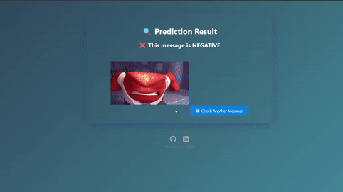

# 😂😡 Sentimental Analysis Web App

A web application built with Flask that analyzes the sentiment of your input text — is it Positive or Negative?

<p align="center">
  
</p>

---

## 📌 Features
- Predict sentiment: Positive or Negative
- Clean Flask interface
- Animated feedback with videos

---

## Project Workflow

### 🔹 Data Cleaning
- Remove URLs, punctuation, special characters  
- Convert to lowercase  
- Remove stopwords  
- Lemmatize words

### 🔹 Feature Extraction
- Tokenize text  
- Apply **TF-IDF** vectorization

### 🔹 Model Training
- Train classifiers (e.g., **SVC**)  
- Evaluate using accuracy

### 🔹 Model Saving
- Save model & vectorizer using `joblib`

### 🔹 Deployment
- Build a simple Flask web app for real-time prediction

---

## Requirements

Install dependencies using:

```bash
pip install -r requirements.txt         
```
## Links

- - **LinkedIn:** [https://www.linkedin.com/in/o2204]
- - **Kaggle:** [https://www.kaggle.com/code/omaratef200/email-spam-or-ham-detection]

---

## 💬 Feedback and Collaboration

Feel free to connect with me on  
[](https://www.linkedin.com/in/o2204)  
for feedback or potential collaboration!

---
This project is part of my continuous journey in the field of AI and machine learning. I’m excited to keep exploring real-world applications that create business impact!

